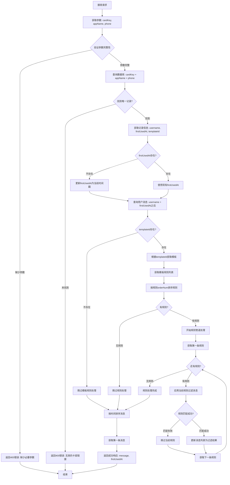

# 公共消息API处理流程图



## 详细说明

### 1. 参数验证阶段
- **输入参数**: `cardKey`, `appName`, `phone`
- **验证逻辑**: 三个参数都必须存在
- **日志**: 记录接收到的参数
- **错误处理**: 返回400状态码和错误信息

### 2. 卡密链接验证阶段
- **查询条件**: `cardKey + appName + phone` 精确匹配
- **期望结果**: 找到唯一的一条记录
- **获取信息**: `username`, `firstUsedAt`, `templateId`
- **日志**: 记录查询条件和结果
- **错误处理**: 未找到记录返回400错误

### 3. 首次使用时间处理阶段
- **判断条件**: `firstUsedAt` 是否存在
- **处理逻辑**: 
  - 不存在：更新为当前时间戳
  - 存在：使用现有值
- **日志**: 记录firstUsedAt的处理过程
- **目的**: 确保有基准时间点

### 4. 消息查询阶段
- **查询条件**: `username` + `firstUsedAt` 之后的时间
- **查询结果**: 该用户在此时间点之后的所有消息
- **日志**: 记录查询到的消息数量

### 5. 模板规则获取阶段
- **判断条件**: `templateId` 是否存在
- **获取模板**: 根据 `templateId` 获取模板
- **获取规则**: 模板下的所有规则
- **规则排序**: 按 `orderNum` 从小到大排序
- **日志**: 记录模板和规则信息

### 6. 规则管道处理阶段
- **管道概念**: 规则按顺序依次应用
- **处理逻辑**: 
  - 每条规则对当前消息列表进行过滤
  - 规则匹配成功则更新消息列表
  - 规则匹配失败则跳过，继续下一条规则
- **日志**: 记录每条规则的处理结果
- **终止条件**: 所有规则处理完毕

### 7. 结果处理阶段
- **时间排序**: 对最终消息列表按时间排序
- **返回结果**: 第一条消息的内容和firstUsedAt
- **日志**: 记录最终返回的消息信息

## 关键特性

### 管道处理
- **规则管道**: 模板规则按orderNum顺序依次应用
- **消息过滤**: 每条规则对消息列表进行过滤
- **累积效果**: 规则处理结果影响后续规则

### 时间基准
- **firstUsedAt**: 作为消息查询的时间基准点
- **动态更新**: 首次使用时自动设置时间戳
- **一致性**: 确保查询结果的一致性

### 错误处理
- **参数验证**: 严格的参数完整性检查
- **数据验证**: 卡密链接的有效性验证
- **优雅降级**: 规则处理失败时的容错机制

### 日志追踪
- **每个步骤**: 记录处理过程和结果
- **关键数据**: 记录重要的中间数据
- **错误信息**: 详细记录错误原因
- **性能监控**: 记录处理时间

## 数据库查询示例

### 1. 卡密链接查询
```sql
SELECT username, firstUsedAt, templateId 
FROM cardLinks 
WHERE key = ? AND appName = ? AND phones = ?
```

### 2. 消息查询
```sql
SELECT * FROM messages 
WHERE username = ? AND receivedAt > ? 
ORDER BY receivedAt DESC
```

### 3. 模板规则查询
```sql
SELECT r.* FROM rules r
WHERE r.templateId = ?
ORDER BY r.orderNum ASC
```

## 响应格式

### 成功响应
```json
{
  "success": true,
  "message": "过滤后的第一条消息内容",
  "firstUsedAt": 1640995200000
}
```

### 错误响应
```json
{
  "success": false,
  "error": "错误描述信息"
}
```

## 日志格式示例

```
[INFO] 接收请求 - cardKey: xxx, appName: xxx, phone: xxx
[INFO] 卡密链接查询 - 找到记录: username=xxx, templateId=xxx
[INFO] firstUsedAt处理 - 使用现有值: 1640995200000
[INFO] 消息查询 - 找到 10 条消息
[INFO] 模板处理 - 找到模板: xxx, 规则数量: 5
[INFO] 规则管道开始 - 规则1: 匹配成功, 过滤后剩余 3 条消息
[INFO] 规则管道继续 - 规则2: 匹配失败, 跳过
[INFO] 规则管道完成 - 最终剩余 1 条消息
[INFO] 返回结果 - 消息内容: xxx
``` 